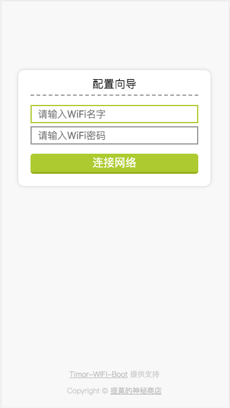

# Timor-WIFI-Boot

ESP8266/ESP32 WiFi Connection manager with beautiful web configuration base on NodeMCU Lua.

一个使用漂亮的 web 界面来管理 ESP8266/ESP32 网络配置的开源项目，基于 NodeMcu Lua。

#### 官网：http://timor.tech/project/timor-wifi-boot 

#### 交流群 QQ: 230948257

有任何问题都可以联系，包括技术问题、开发板和屏幕购买。

## 预览



## 特点

1. 所有代码开源，可自定义修改
2. 使用 Lua 编写，代码简单，可读性高（简单是最重要的）
3. 支持 OLED 屏幕，实时显示状态和日期时间
4. 支持历史记录，断电永久保存，开机自动连接
5. 网络监控，断线自动重连+打开 AP，联网 AP 自动关闭
6. 自带 HTTP Server，无需任何第三方 APP
7. 界面使用 HTML + CSS + JavaScript，开发简单

## Feature

1. All codes are open source and can be customized and modified
2. Written with Lua, simple code, high readability (simplicity is the most important)
3. Support OLED screen, real-time display status and date time
4. Support historical record, power off for permanent storage, power on for automatic connection
5. Network monitoring, disconnection automatic reconnection + AP on, networking AP automatically closed
6. With HTTP server, no third-party app is required
7. The interface uses HTML + CSS + JavaScript, which is easy to develop

## 环境

该项目基于 NodeMcu，使用 Lua 编写，支持 ESP8266/ESP32。

以下环境是必须要的：

1. ESP8266 或者 ESP32 开发板
2. [ESPlorer](https://esp8266.ru/esplorer/) 用于上传代码、调试。可以根据喜好选择其它工具。
3. [nodemcu-pyflasher](https://github.com/marcelstoer/nodemcu-pyflasher) 用于烧写固件。可以根据喜好选择其它工具。

## 安装

安装该项目非常简单，所有必须的文件本项目都自带了，你只需要将它们上传到 ESP8266 或者 ESP32 开发板上。

### 第一步：烧写固件

因为其中的一些功能需要特定的模块支持，所以必须得烧写包含依赖模块的固件，项目里的 [nodemcu-integer.bin](./nodemcu-integer.bin) 包含了最小依赖，使用 nodemcu-pyflasher 将它烧录至开发板。

当然你也可以自己定制固件。

### 第二步：上传代码

打开 ESPlorer，连接开发板。

烧写固件完成后，手动复位一下开发板，它会自动格式化文件系统。一般 5-10 秒可完成。

然后按照顺序，依次将下列文件上传到开发板：

1. [index.html](./index.html) 这是 web 配置界面，CSS 和 JavaScript 已集成，无需网络。
2. [httpServer.lua](./httpServer.lua) 这是提供 HTTP 服务的组件。
3. [init.lua](./init.lua) 这是应用主代码。

## 运行

上面的文件不能改名，必须原样保存。全部文件上传完后，手动复位一下，代码就会运行。

此时可以查看 OLED 屏幕，或者查看串口输出。

## 配置网络

使用手机打开 WIFI，能看到 `Timor-WIFI-Boot` 的热点，无密码。点击连接。

然后打开浏览器，输入 `192.168.4.1` 即可打开页面。

在输入框输入 WIFI账号 和 密码，点击 `连接网络` 按钮即可。

配置成功会弹出窗口提示。此时开始连接网络，连接成功 AP 会自动关闭，连接失败可再次点击按钮配置。

连接网络成功后，OLED 屏幕会进入日期时间页面，自动同步当前时间。

配置网络是永久保存的，下次开机会自动连接。

## OLED 屏幕

本项目默认使用 SSD1306 128*32 IIC 屏幕，默认接线如下：

```lua
local i2cSDA = 5
local i2cSCL = 6
```

即开发板的 D5 接屏幕的 SDA，D6 接屏幕的 SCL。如果你想使用其它引脚，请自行配置。

如果你想支持其它型号的屏幕，也非常简单。u8g2 支持的屏幕都可以使用，当然，你还可以自行实现屏幕驱动。

如果你不想要 OLED 屏幕支持，不接也可以运行，但最好将屏幕绘制部分代码和驱动代码删除，以节约内存。

# API 文档

## OLED 绘制

#### 连接历史记录界面

```lua
local renderOnHistory = function ()
	oled:drawStr(0, 0, 'Connecting: '..SSID)
end
```

#### 启动(AP)界面 (无历史记录)

```lua
local renderOnStartup = function ()
	oled:drawStr(0, 0, 'Startup...')
end
```

#### 设置界面(等待用户配置网络)

```lua
local renderOnSetup = function ()
	oled:drawStr(0, 0, 'Waiting for User...')
end
```

#### 已连接网络界面

```lua
local renderOnConnected = function ()
	font_helvB14_tr()
	local rtm = rtctime.epoch2cal(rtctime.get())
	oled:drawStr(28, 0, string.format("%02d:%02d:%02d", rtm['hour']+8, rtm['min'], rtm['sec']))
end
```

以上是各阶段的屏幕绘制 API，用户只需实现里面的具体绘制操作就行。绘制函数每秒刷新一次。

如果想提高刷新率，请更改:

```lua
oled_timer:alarm(1000, tmr.ALARM_AUTO, renderDisplay)
```

单位为毫秒。建议不要小于 `30` 毫秒，太快的刷新率将会触发看门狗、影响 WIFI 稳定性、循环死机等不可预料的情况。

如果分辨率比较大，可以适当提高 IIC 速率，以减少传输时间，目前固件最高支持 `1MHz` 速率。

如果使用彩色屏幕，可以使用 SPI 传输。

## 内存

NodeMcu 内存资源有限，总内存 `48KB` 左右，运行此项目后，剩余可用内存 `20KB` 左右，留给业务逻辑的内存非常有限，如果不是必须的模块，尽量不要编译进去，以节约这可怜的一点点内存。

另外，适当的调用 `collectgarbage()` 函数以进行垃圾回收。
